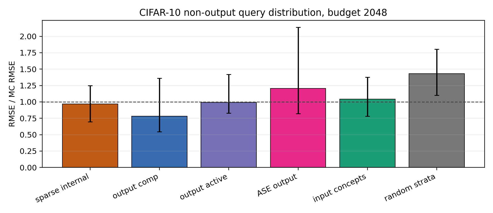
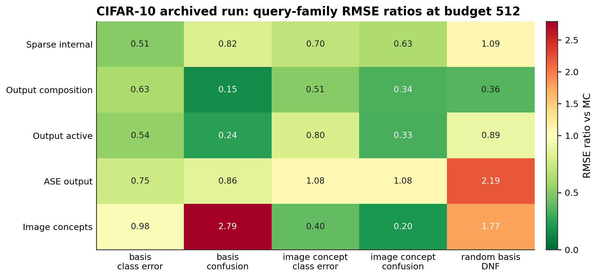
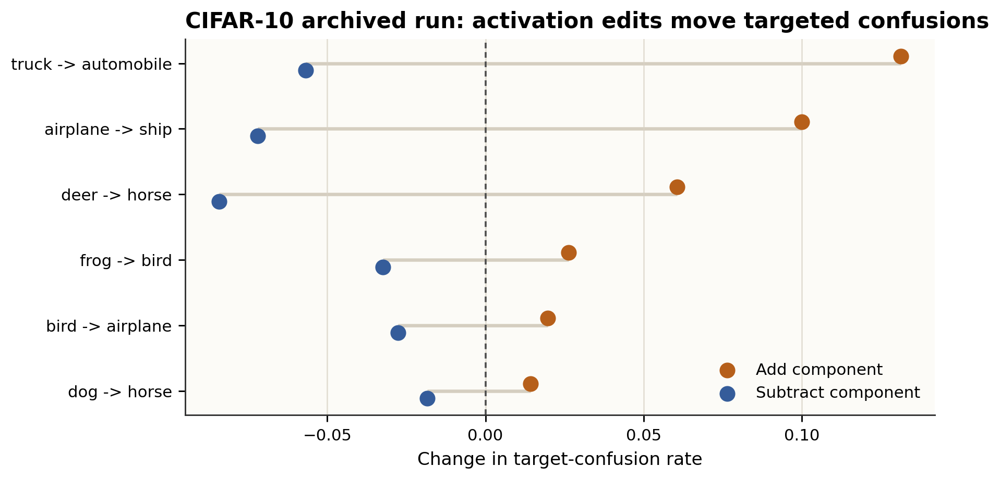

# A Worked Example of Competing With Sampling for Rare-Failure Auditing

Date: 2026-05-22

## Abstract

ARC's "competing with sampling" agenda asks whether structural understanding of a model can estimate an expectation as accurately as random sampling, using comparable or less work. This paper gives a concrete empirical instance of that question for rare classifier failures. The quantity to estimate is not ordinary accuracy. It is the rate of a query-specific rare event: for example, "among inputs satisfying a sparse activation predicate and a class condition, how often does the model fail?"

We instantiate ARC's objects as follows. The detector \(C_c\) is a rare-failure predicate indexed by a query context \(c\). The explanation algorithm \(E\) builds a reusable sparse basis over model activations and fits reusable atom predictors. The estimator \(G\) uses that explanation to rank examples, spends a small label budget on high-information strata, and returns an unbiased stratified estimate of \(\mathbb{E}[C_c]\). The experiment is therefore not a label-free mechanistic proof of the failure rate. It is a hybrid test: can reusable structural advice make sampling materially more efficient?

On CIFAR-10, using a ResNet-18 initialized with public ImageNet weights and a trained linear head, the sparse-internal estimator achieved an RMSE ratio of `0.561` against same-budget Monte Carlo at 512 labels per query over 12 rare-failure queries, with a model-query bootstrap interval of `[0.433, 0.753]`. Including the one-time build stream, it beat label-matched Monte Carlo after 5 audited queries. At 2048 labels per query, the sparse-internal result was not decisive: RMSE ratio `0.970`, interval `[0.698, 1.247]`. The supported claim is narrow but real: for this pre-specified family of rare, concept-conditioned classifier failures, a sparse activation basis can be reused as audit infrastructure that competes with sampling at low label budgets.

## 1. The Estimation Problem

Let \(f_\theta\) be a trained classifier and let \((x,y) \sim D\) be a labeled example from the deployment distribution. A rare-failure audit query asks for a number

\[
p_c = \mathbb{E}_{(x,y)\sim D}[C_c(f_\theta,x,y)],
\]

where \(c\) is a query context and \(C_c\in\{0,1\}\) is the corresponding event detector. Examples of contexts in this paper include:

- a sparse activation component is high, the true class is deer, and the model is wrong;
- a hand-defined image concept is present and the model confuses one class for another;
- a Boolean formula over sparse activation predicates holds and the classifier fails.

The hard case is rarity. If \(p_c=0.003\), then 512 uniformly sampled labels have high relative variance. The natural baseline is Monte Carlo:

\[
\hat p^{\text{mc}}_c = \frac{1}{n}\sum_{i=1}^n C_c(f_\theta,x_i,y_i).
\]

This estimator is simple, unbiased, and hard to beat in the worst case. To improve on it, an auditor needs usable structure: some way to know where the event is concentrated before spending labels.

## 2. ARC's Question, Specialized

ARC's framing starts from the observation that sampling is a strong default standard. A method should not merely produce an intuitive explanation; it should use structure to estimate the relevant expected value with error competitive with random sampling. In ARC's mainline notation, the object is a function \(M_\theta(c,x)\), a short explanation \(\pi\), and an estimator

\[
G_M(\theta,\pi,c,\varepsilon) \approx \mathbb{E}_x[M_\theta(c,x)]
\]

with expected squared error competitive with sampling, averaged over contexts \(c\). ARC's findable-explanations variant additionally asks for an algorithm \(E\) that constructs \(\pi\) from the same kind of information used to train or obtain the model, rather than assuming the explanation is handed down by an oracle.

This paper studies a weaker but directly testable version. We set

\[
M_\theta(c,x,y) = C_c(f_\theta,x,y),
\]

so the target is a rare-failure probability. The estimator is allowed to request labels for a small number of examples. The explanation is useful only if it reduces the sampling error enough to pay for its build cost.

The mapping is exact at the level of objects:

| ARC object | This experiment |
| --- | --- |
| \(c\) | A sampled audit query: a rare-failure predicate over labels, predictions, image concepts, and sparse activation atoms. |
| \(C_c\) | The binary detector that evaluates whether an example satisfies query \(c\). |
| \(M_\theta\) | The audited classifier together with the detector family, written as \(M_\theta(c,x,y)=C_c(f_\theta,x,y)\). |
| \(E\) | The build procedure that learns a sparse activation dictionary, calibrates atom predictors, and returns reusable audit advice. |
| \(\pi\) | The resulting explanation: dictionary components, atom heads, thresholds, and the query compiler. |
| \(G\) | A stratified estimator that uses \(\pi\) and \(c\) to prioritize labels and estimate \(p_c\). |

The important difference is also exact: ARC's strongest aspiration is mechanistic estimation of an expectation from structural understanding. This paper's \(G\) still samples labels. The experiment tests whether mechanistic-looking structure can make sampling more efficient, not whether it can replace sampling.

## 3. The Explanation \(\pi\)

The explanation is a reusable coordinate system for failure queries. It is built once, before the individual audit queries are evaluated.

First, collect penultimate activations \(h(x)\) from the classifier. Learn a sparse dictionary so that activations are approximated by

\[
h(x) \approx D z(x),
\]

where \(z(x)\) is sparse. A component threshold such as \(z_j(x)>\tau_j\) becomes an internal atom. The atom is not assumed to be fully human-legible. It is a reusable predicate over the model's internal state.

Second, fit atom heads for predicates that recur across queries. These include true-class atoms, predicted-class atoms, model-error atoms, confidence atoms, simple image-concept atoms, and sparse-basis threshold atoms.

Third, compile a Boolean query into a scalar risk score. Conjunctions are approximated by multiplying atom probabilities; disjunctions are approximated with noisy OR. The score is not the final answer. It is a guide for where labels are likely to matter.

This gives a useful division of labor:

- \(E\) finds coordinates and reusable atom predictors once;
- \(c\) selects a particular rare event to audit;
- \(G\) turns the explanation and context into a label-allocation policy;
- the final estimate still comes from observed event labels.

## 4. The Estimator \(G\)

For a fixed query \(c\), the estimator computes a score \(s_c(x)\) for each candidate example. It partitions the pool into strata by score, samples labels from each stratum, and returns the stratified estimate

\[
\hat p_c = \sum_k w_k \hat p_{c,k},
\]

where \(w_k\) is the population mass of stratum \(k\) and \(\hat p_{c,k}\) is the observed event rate among labeled examples in that stratum. This keeps the estimate tied to real labels while using structure to reduce variance.

The methods differ only in how they construct \(s_c(x)\):

| Method | Score source |
| --- | --- |
| `mc` | No score; uniform sampling. |
| `random_stratified` | Random score with the same stratified estimator. |
| `output_active` | Confidence and predicted-class information from model outputs. |
| `output_comp` | Output-only atom composition. |
| `ase_output` | Output-only active surrogate estimation. |
| `input_concept_comp` | Hand-defined image concepts plus output atoms. |
| `sparse_internal` | Sparse activation atoms, atom heads, and query compilation from \(\pi\). |

Thus the comparison is controlled: every method estimates the same \(p_c\); the question is which source of structure produces lower error for a fixed label budget.

## 5. Experimental Instance

The experiment uses CIFAR-10 and a ResNet-18 initialized with public ImageNet weights. The backbone is frozen and a linear CIFAR-10 head is trained on 6000 examples for one epoch. Evaluation accuracy is `0.681` and evaluation NLL is `0.951`.

| Quantity | Value |
| --- | --- |
| Dataset | CIFAR-10 |
| Model | ResNet-18, public ImageNet weights, frozen backbone |
| Seed | `20260521` |
| Sparse dictionary components | `48` |
| Build stream | `6000` examples |
| Query-selection stream | `8000` examples |
| Reference stream | `10000` examples |
| Risk-evaluation stream | `6000` examples |
| Queries | `12` |
| Rare-rate filter | `0.001` to `0.04` |
| Label budgets | `512`, `2048` labels per query |
| Replicates | `3` |

The query generator samples query families before seeing reference rates, then keeps queries whose selection-stream rates fall in the rare-rate band. This produces a workload where most queries are not simply "low confidence equals failure."

| Query family | Queries | Mean reference rate |
| --- | --- | --- |
| Sparse-basis class error | 4 | `0.0261` |
| Sparse-basis confusion | 1 | `0.0043` |
| Image-concept class error | 4 | `0.0062` |
| Image-concept confusion | 2 | `0.0026` |
| Random sparse-basis DNF | 1 | `0.0034` |

## 6. Main Result

The primary metric is RMSE relative to same-budget Monte Carlo, averaged over query-replicate cells. Values below `1.0` beat sampling. Because this is an RMSE ratio, the corresponding MSE ratio is its square.

| Budget | Method | RMSE ratio vs MC | Bootstrap interval |
| --- | --- | --- | --- |
| 512 | `sparse_internal` | `0.561` | `[0.433, 0.753]` |
| 512 | `output_active` | `0.587` | `[0.368, 0.953]` |
| 512 | `output_comp` | `0.595` | `[0.464, 0.689]` |
| 512 | `ase_output` | `0.848` | `[0.688, 1.202]` |
| 512 | `random_stratified` | `0.888` | `[0.759, 1.178]` |
| 512 | `input_concept_comp` | `0.973` | `[0.652, 1.439]` |
| 512 | `mc` | `1.000` | `[1.000, 1.000]` |
| 2048 | `output_comp` | `0.780` | `[0.546, 1.362]` |
| 2048 | `sparse_internal` | `0.970` | `[0.698, 1.247]` |
| 2048 | `output_active` | `0.993` | `[0.827, 1.419]` |
| 2048 | `mc` | `1.000` | `[1.000, 1.000]` |
| 2048 | `input_concept_comp` | `1.044` | `[0.781, 1.378]` |
| 2048 | `ase_output` | `1.205` | `[0.820, 2.137]` |
| 2048 | `random_stratified` | `1.433` | `[1.102, 1.803]` |



At 512 labels, the sparse-internal estimator has `56.1%` of Monte Carlo RMSE, or `31.5%` of Monte Carlo MSE. That is the cleanest empirical instance of competing with sampling in this repo. At 2048 labels, Monte Carlo has less variance, and the sparse-internal advantage is no longer clear.

## 7. Amortizing \(E\)

The explanation builder consumes data. A result that ignores the build cost could be misleading, because Monte Carlo could have spent those labels directly on the target query. We therefore compare each reusable method to a label-matched Monte Carlo estimator with average label count

\[
\text{budget} + \frac{\text{build examples}}{\text{audited queries}}.
\]

| Budget | Method | First query count beating label-matched MC | Final audited queries | Final RMSE ratio vs label-matched MC |
| --- | --- | --- | --- | --- |
| 512 | `sparse_internal` | 5 | 12 | `0.899` |
| 512 | `output_comp` | 6 | 12 | `0.954` |
| 512 | `input_concept_comp` | 1 | 12 | `1.561` |
| 2048 | `output_comp` | 2 | 12 | `0.711` |
| 2048 | `sparse_internal` | 4 | 12 | `0.883` |
| 2048 | `input_concept_comp` | 2 | 12 | `0.951` |

This matters for the ARC analogy. The explanation \(\pi\) is not a per-query trick. Its value is amortized over a distribution of contexts \(c\). In this experiment, the one-time sparse explanation pays back after 5 audited queries at the 512-label budget and after 4 audited queries at the 2048-label budget.

## 8. Where the Structure Helps

The estimator that wins depends on the query family. This is a sanity check, not a nuisance: different explanations should help different contexts.

At 512 labels:

- `sparse_internal` is best on sparse-basis class-error queries: RMSE ratio `0.506` over four queries.
- `output_comp` is best on the single sparse-basis confusion query: `0.150`.
- `output_comp` is best on the random sparse-basis DNF query: `0.355`.
- `input_concept_comp` is best on image-concept class-error queries: `0.397`.
- `input_concept_comp` is best on image-concept confusion queries: `0.203`.



The result is not "sparse bases always win." The more precise lesson is that the right advice depends on the context distribution. Sparse internal atoms help most when the query refers to sparse internal structure. Output scores help when the failure is already visible in confidence or predicted class. Hand-defined image concepts help when the query is written in those concepts.

## 9. Diagnostics on \(\pi\)

The dictionary is not claimed to be a complete semantic model of the classifier. The diagnostics check whether it is stable and interventionally relevant enough to serve as audit advice.

| Diagnostic | Value |
| --- | --- |
| Reconstruction \(R^2\) | `0.251` |
| Code density | `0.167` |
| Active components per example | `8.0` |
| Split-half stability cosine | `0.402` |

A small activation intervention provides an additional check. For six common class-confusion pairs, the experiment selected the sparse component whose decoder direction most increased the target-vs-source class logit margin. Adding that component increased the target confusion rate for all six pairs; subtracting it decreased the target confusion rate for all six pairs.



This supports a limited interpretation: the sparse basis captures directions that are predictive and directionally causal for some classifier behavior. It does not show that each component is a crisp human concept or that the dictionary is sufficient for arbitrary audits.

## 10. Claim Ledger

This section states the result in the form needed for the competing-with-sampling question.

Supported claims:

- There exists a concrete \(E\) that builds reusable sparse audit advice \(\pi\) from model activations.
- For the tested query distribution, \(G(\theta,\pi,c)\) beats same-budget Monte Carlo at 512 labels per query: RMSE ratio `0.561`, interval `[0.433, 0.753]`.
- The build cost can amortize across related contexts: sparse-internal beats label-matched Monte Carlo after 5 audited queries at budget 512.
- The advantage is context-dependent in the expected way: sparse, output, and hand-concept advice each win on the query families most aligned with their information source.
- The dictionary has modest but nonzero reconstruction quality, sparse usage, split-half stability, and directional intervention evidence.

Unsupported claims:

- This is not a proof of ARC's full competing-with-sampling target.
- This is not a label-free mechanistic estimator of \(\mathbb{E}[C_c]\).
- This does not show that sparse dictionary components are complete, human-legible causal variables.
- This does not show robustness across architectures, seeds, datasets, or arbitrary externally chosen query distributions.
- This does not imply that the sparse-internal method dominates simpler output-only methods at larger budgets.

The paper's central claim is therefore deliberately operational: reusable structural advice can make rare-failure sampling more efficient on this workload.

## 11. Relation to ARC's Original Idea

ARC's post emphasizes a standard: an explanation should earn its keep by estimating expectations competitively with sampling. This paper follows that standard in three ways.

First, the metric is squared-error competition against sampling, not explanation plausibility. A dictionary that looks interesting but fails to reduce estimation error would not count as success.

Second, the context distribution matters. ARC's mainline setup evaluates error on average over contexts \(c\). Here, \(c\) is the rare-failure query. The empirical claim is about a distribution of sparse-basis, image-concept, and confusion queries, not a single cherry-picked event.

Third, the explanation is findable. The advice \(\pi\) is built by an explicit procedure \(E\) from the model's activations and calibration streams. It is not an oracle string containing the answer.

The difference is equally important. ARC's motivating examples often aim for mechanistic estimates that replace brute-force sampling. This experiment uses mechanistic advice to improve sampling. In ARC terms, \(G\) is not yet a purely deductive estimator. It is a variance-reduction estimator whose proposal distribution is informed by \(\pi\). That makes the result weaker than ARC's full target, but easier to audit: every reported estimate is corrected by observed labels from the target detector.

A useful way to state the relationship is:

\[
\text{full competing-with-sampling target asks: can structure estimate the expectation?}
\]

\[
\text{this paper asks: can findable structure reduce the sampling needed to estimate it?}
\]

The answer in this repo is yes for the tested CIFAR-10 rare-failure workload at low label budgets.

## 12. Limitations and Next Tests

The main limitations are scale and external validity. The experiment uses one seed, one classifier family, one dataset, and 12 queries. The model is useful for testing the estimator but is not a frontier model. The query distribution is structured by the experiment rather than supplied by an external auditor.

The decisive next tests are straightforward:

- repeat across more seeds and model families;
- use stronger classifiers while preserving access to activations;
- preregister larger external query distributions before seeing rates;
- compare against stronger active testing and importance-sampling baselines;
- test whether sparse advice still amortizes when build streams are priced more conservatively;
- measure when output-only advice is sufficient and sparse internal advice is unnecessary.

These are not cosmetic extensions. They determine whether the result is a reusable auditing method or a promising small-instance demonstration.

## 13. Reproducibility

Install dependencies:

```bash
python -m venv .venv
. .venv/bin/activate
pip install -r requirements.txt
```

Run the archived CIFAR-10 configuration:

```bash
.venv/bin/python experiments/src/sparse_concept_rare_event_suite.py \
  --dataset cifar10 \
  --model-type resnet18 \
  --use-public-weights \
  --freeze-backbone \
  --seeds 20260521 \
  --train-n 6000 \
  --epochs 1 \
  --concept-calib-n 2500 \
  --build-n 6000 \
  --select-n 8000 \
  --ref-n 10000 \
  --risk-eval-n 6000 \
  --intervention-n 5000 \
  --pool-n 3072 \
  --query-count 12 \
  --max-candidates 1800 \
  --budgets 512 2048 \
  --reps 3
```

Archived result files are under `experiments/results/stronger/cifar10_*`.

## 14. Conclusion

This paper demonstrates a narrow but meaningful version of competing with sampling. A sparse activation basis learned once from a classifier can be reused as audit advice across rare-failure queries. Given that advice, a stratified estimator can spend labels more efficiently than uniform Monte Carlo at low budgets, and the one-time build cost can be amortized over related audits.

The result should be read as evidence for an intermediate step toward ARC's goal. It does not solve mechanistic estimation. It shows that findable structure can improve empirical estimation of rare failures, which is one concrete way for explanation to become operational rather than merely descriptive.

## References

- Eric Neyman, Victor Lecomte, Wilson Wu, Michael Winer, Jacob Hilton, and George Robinson, Competing with sampling, Alignment Research Center, 2025. https://www.alignment.org/blog/competing-with-sampling/
- Kossen et al., Active Testing: Sample-Efficient Model Evaluation, ICML 2021. https://arxiv.org/abs/2103.05331
- Kossen et al., Active Surrogate Estimators, NeurIPS 2022. https://arxiv.org/abs/2202.06881
- Chen et al., Mandoline: Model Evaluation under Distribution Shift, ICML 2021. https://proceedings.mlr.press/v139/chen21i.html
- Au and Beck, Estimation of small failure probabilities in high dimensions by subset simulation, Probabilistic Engineering Mechanics, 2001. https://www.sciencedirect.com/science/article/pii/S0266892001000194
- Geiger et al., Inducing Causal Structure for Interpretable Neural Networks, ICML 2022. https://proceedings.mlr.press/v162/geiger22a.html
- Marks et al., Sparse Feature Circuits, 2024. https://arxiv.org/abs/2403.19647
