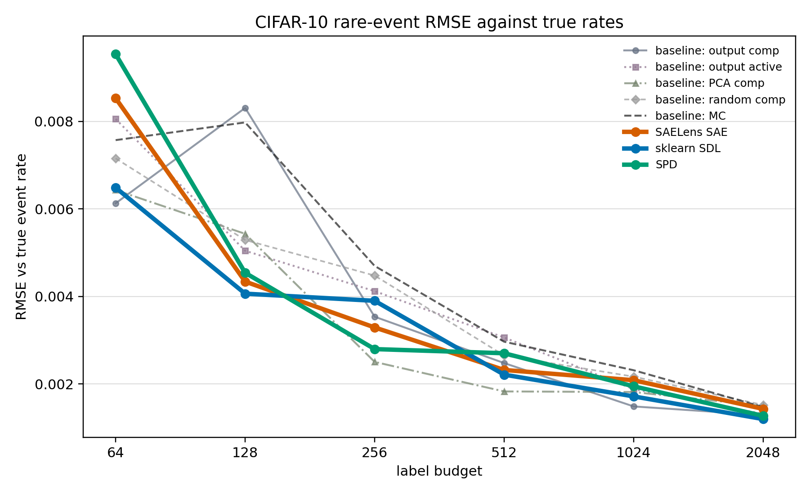

# Amortized Rare-Event Auditing Under a Competing-With-Sampling Criterion

Date: 2026-05-23

## Abstract

ARC's competing-with-sampling agenda asks whether structural understanding of a model can improve the estimation of a specified expectation under a resource constraint. We instantiate that question as rare-event auditing for a CIFAR-10 classifier. For a fixed model \(f_\theta\) and an audit context \(c\), the target is the finite-test-set rate of a Boolean event \(A_c(f_\theta,x,y)\). A method first builds a reusable explanation object \(\pi_m=E_m(f_\theta,\mathcal D_{\mathrm{build}})\), then an estimator \(G_m\) uses that object to allocate a per-context label budget.

Twelve frozen rare-event contexts are selected without reference to the tested internal representations. Sparse dictionary learning, a sparse autoencoder implemented with SAELens, and Stochastic Parameter Decomposition (SPD) are compared with Monte Carlo and with output-only, PCA, and random-basis controls. At equal label budgets, structured estimators often reduce RMSE against the true finite-test-set rates, although the best control is sometimes non-internal. After charging a 6000-label build stage, sklearn sparse dictionary learning has the clearest amortized result, with point-estimated break-even after 8 to 83 future rare-event queries across the tested budgets. SPD breaks even after 10 to 41 queries for budgets 128 through 2048, and the SAELens-implemented SAE after 13 to 382 queries. Bootstrap intervals are wide, especially at the smallest budget. The supported claim is narrow but positive: reusable model-internal structure can compete with sampling for independently specified rare-event audits under a sequential audit workflow.

## 1. Introduction

Random sampling is a demanding baseline for claims about model understanding. It is unbiased, easy to audit, and hard to improve on without exploitable structure. ARC's competing-with-sampling program sharpens this point: an explanation should not merely be interpretable; it should help estimate a target expectation more efficiently than sampling alone.

Rare-event auditing makes the comparison concrete. Many safety-relevant questions concern rates far below ordinary accuracy: high-confidence false positives, specific class confusions, or failures on a narrow input condition. For a Bernoulli event with rate near \(10^{-3}\), a few hundred random labels contain only a small number of positives in expectation. Any estimator that can concentrate labels where the event is more likely may reduce error.

The central empirical question is amortized. A structural method may require a build stage: fitting a representation, estimating reusable atom predictors, and compiling future queries into scores. That cost is justified only if the resulting object can be reused. The relevant comparison is not only whether the structured estimator beats Monte Carlo at the same per-query label budget, but whether it beats Monte Carlo after its build cost is spread over a sequence of audit contexts.

The paper gives a finite-population instantiation of ARC's \(C/E/G\) framing, evaluates three externally implemented representation tools rather than reimplementing their core algorithms, and reports both same-budget RMSE and amortized break-even query counts. The controls are intentionally strong enough to separate a general advantage from one that is specific to the tested internal representations.

## 2. Related Work

ARC's "competing with sampling" proposal treats sampling as the default standard for estimating expected values. The relevant question is not whether an explanation is intuitively satisfying, but whether it reduces estimation error under a comparable resource budget. The present experiment keeps labels in the loop: it tests whether learned structure can make a small number of labels more informative for rare-event estimation.

That test places the estimator in the lineage of stratified sampling. Neyman's allocation rule and later survey-sampling treatments show how strata reduce variance when they separate high- and low-risk subpopulations. Active Testing and Active Surrogate Estimators ask closely related questions for label-efficient model evaluation; Mandoline studies evaluation under distribution shift using user-defined slices. In contrast to much of that literature, the strata here are derived from reusable model-understanding objects rather than from a one-off surrogate fitted only for the current query.

The representation side draws on sparse coding and mechanistic interpretability. Olshausen and Field, K-SVD, and online dictionary learning provide the classical sparse-code background. Sparse autoencoders have become a standard tool for finding interpretable features in neural networks, including the language-model SAE line, Anthropic's monosemanticity work, SAELens, Gemma Scope, and sparse feature circuits. SPD is different: it decomposes parameters rather than activations, following Attribution-based Parameter Decomposition and using parameter-space components as the source of audit features.

## 3. Problem Formulation

Let \(f_\theta\) be a trained classifier and let \((x_i,y_i)_{i=1}^N\) be the finite reference population. In this experiment \(N=10000\), the CIFAR-10 test set. An audit context \(c\) defines a Boolean predicate

\[
A_c(f_\theta,x,y)\in\{0,1\}.
\]

The target for context \(c\) is the finite-population event rate

\[
p_{c,N}=\frac{1}{N}\sum_{i=1}^N A_c(f_\theta,x_i,y_i).
\]

ARC's notation uses both a context \(c\) and an event detector \(C\). Here, \(c\) is the audit query, \(C\) is instantiated by the query-indexed predicate \(A_c\), and the finite benchmark suite is denoted \(\mathcal C_{\mathrm{suite}}\). Extrapolations beyond twelve observed contexts treat \(\mathcal C_{\mathrm{suite}}\) as a small sample from a future-query distribution \(\mathcal C\).

For method \(m\), the build stage is

\[
\pi_m=E_m(f_\theta,\mathcal D_{\mathrm{build}},\mathcal A_{\mathrm{atoms}},R_E),
\]

where \(\mathcal D_{\mathrm{build}}\) contains build images, labels, logits, penultimate activations, and pre-declared image statistics; \(\mathcal A_{\mathrm{atoms}}\) is the atom vocabulary; and \(R_E\) is build-stage randomness. The resulting \(\pi_m\) contains the learned representation, atom predictors, thresholds, and query compiler.

For audit replicate \(r\), let \(P^{\mathrm{strat}}_r\subseteq [N]\) be the candidate pool used by stratified estimators, and let \(O_c(i)\) reveal \(A_c(f_\theta,x_i,y_i)\) for a queried example. The estimator is

\[
\hat p_{m,c,b,r}=G_m(\pi_m,c,P^{\mathrm{strat}}_r,b,O_c,U),
\]

where \(b\) is the label budget and \(U\) is estimator randomness. The empirical Monte Carlo baseline uses a separate pool \(P^{\mathrm{MC}}_r\) and no \(\pi_m\):

\[
\hat p^{\mathrm{MC}}_{c,b}=\frac{1}{b}\sum_{i\in S_b} A_c(f_\theta,x_i,y_i),
\]

with \(S_b\subseteq P^{\mathrm{MC}}_r\) sampled uniformly without replacement. In the implementation, \(|P^{\mathrm{strat}}_r|=3072\) and \(|P^{\mathrm{MC}}_r|=2048\).

For a single method panel before post-processing, the empirical RMSE over the observed suite is

\[
\widehat{\mathrm{RMSE}}_{m,b}
=
\left(
\frac{1}{|\mathcal C_{\mathrm{suite}}|R}
\sum_{c\in\mathcal C_{\mathrm{suite}}}
\sum_{r=1}^R
(\hat p_{m,c,b,r}-p_{c,N})^2
\right)^{1/2}.
\]

The estimator is evaluated against \(p_{c,N}\), not merely against its audit-pool rate. For a pool \(P\), define

\[
p_{c,P}=\frac{1}{|P|}\sum_{i\in P}A_c(f_\theta,x_i,y_i).
\]

The stratified estimator is conditionally unbiased for \(p_{c,P^{\mathrm{strat}}_r}\) given \(P^{\mathrm{strat}}_r\) and the score vector. The empirical Monte Carlo estimate is conditionally unbiased for \(p_{c,P^{\mathrm{MC}}_r}\). Reported error against \(p_{c,N}\) therefore combines pool-sampling error with within-pool label-sampling error.

## 4. Benchmark Protocol and Methods

### 4.1 ARC Objects in the Experiment

The benchmark instantiates ARC's \(C/E/G\) pattern at the level of a finite population. The context \(c\) names a rare-event predicate; \(C\) is the corresponding detector \(A_c\); \(E_m\) builds a reusable object \(\pi_m\); and \(G_m\) uses \(\pi_m\), \(c\), and a label budget to return an estimate. The same \(G_m\) form is used for the structured methods: compile the context into a score over the audit pool, stratify by that score, sample labels inside strata, and aggregate by stratum weights.

| method family | \(E_m\) and reusable object \(\pi_m\) | query-to-score map | estimator \(G_m\) | build labels |
| --- | --- | --- | --- | ---: |
| Monte Carlo | none | none | uniform labels from \(P^{\mathrm{MC}}_r\) | `0` |
| `output_active` | output priors from logits | confidence, margin, entropy, predicted class | stratified estimator | `0` |
| `output_comp` | supervised atom heads on output features | Boolean-query atom composition | stratified estimator | `6000` |
| `pca_comp` | PCA coordinates plus supervised atom heads | Boolean-query atom composition | stratified estimator | `6000` |
| `random_comp` | random sparse dictionary plus supervised atom heads | Boolean-query atom composition | stratified estimator | `6000` |
| `saelens_sae` | SAELens SAE codes, thresholds, supervised atom heads | Boolean-query atom composition | stratified estimator | `6000` |
| `sklearn_sdl` | sklearn dictionary codes, thresholds, supervised atom heads | Boolean-query atom composition | stratified estimator | `6000` |
| `spd` | SPD causal-importance vectors, thresholds, supervised atom heads | Boolean-query atom composition | stratified estimator | `6000` |

The protocol fixes the audit workload before fitting the tested representation methods, evaluates all estimators against the same reference rates \(p_{c,N}\), and treats the representation build as a reusable investment. Labels used to select benchmark contexts are part of workload construction rather than estimator operation. This accounting is appropriate for asking how much an already specified audit workload costs to estimate, but it is not a claim that audit-question discovery itself is free.

### 4.2 Model and Data

The benchmark uses CIFAR-10 with a ResNet-18 classifier. Public ImageNet weights initialize the backbone; the backbone is frozen; a linear CIFAR-10 head is trained for one epoch on 6000 training examples.

| Quantity | Value |
| --- | --- |
| Dataset | CIFAR-10 |
| Model | ResNet-18, public ImageNet weights, frozen backbone |
| Seed | `20260521` |
| Head training examples | `6000` |
| Epochs | `1` |
| Evaluation accuracy | `0.681333` |
| Evaluation NLL | `0.950644` |
| Dictionary components | `48` |
| Build stream | `6000` examples |
| Query-selection stream | `8000` examples |
| Reference stream | `10000` examples |
| Risk-evaluation stream | `6000` examples |
| Structured audit pool per replicate | `3072` examples |
| Empirical MC pool per replicate | `2048` examples |
| Replicates | `3` |
| Frozen rare-event contexts | `12` |
| Budgets | `64, 128, 256, 512, 1024, 2048` |

The classifier head is trained from the CIFAR-10 training split. The build, query-selection, reference, risk-evaluation, structured audit, and empirical MC streams are sampled from the CIFAR-10 test split. Sampling is without replacement within each named stream when the stream size is at most the split size; the named streams are not constrained to be mutually disjoint. The reference stream is the full CIFAR-10 test set, so each `reference_rate` is the exact finite-benchmark rate for the trained model and event predicate. The risk-evaluation stream is used for ranking diagnostics, not for the reported rate estimates.

### 4.3 Rare-Event Contexts

The rare-event contexts form a frozen benchmark workload. They are selected before fitting the representation methods and may depend on labels, predictions, confidence, and pre-defined image statistics from the query-selection stream. They do not depend on SAE, sparse dictionary, or SPD coordinates. This is the independence condition used in the benchmark: the event definitions are not measurable with respect to the tested representation. Every frozen context has `uses_basis=False`. The named streams are not forced to be disjoint, so this is a representation-independence condition rather than a guarantee that query-authoring labels and later audit-pool labels never identify the same CIFAR-10 example.

| id | family | selection rate | reference rate \(p_{c,N}\) | definition |
| ---: | --- | ---: | ---: | --- |
| 0 | `concept_class_error` | `0.009500` | `0.009400` | edge_high and label frog and model error |
| 1 | `output_fp` | `0.005625` | `0.006000` | prediction automobile and label not automobile and confidence > 0.70 |
| 2 | `concept_class_error` | `0.017250` | `0.016300` | bottom_heavy and label cat and model error |
| 3 | `class_confusion` | `0.001125` | `0.001000` | label frog and prediction truck |
| 4 | `output_fp` | `0.001250` | `0.001200` | prediction truck and label not truck and confidence > 0.85 |
| 5 | `output_fp` | `0.002125` | `0.002300` | prediction cat and label not cat and confidence > 0.70 |
| 6 | `concept_class_error` | `0.005875` | `0.006100` | brightness_high and label dog and model error |
| 7 | `concept_class_error` | `0.004875` | `0.004800` | top_heavy and label cat and model error |
| 8 | `class_confusion` | `0.001375` | `0.001400` | label dog and prediction airplane |
| 9 | `concept_class_error` | `0.004500` | `0.005300` | right_heavy and label ship and model error |
| 10 | `concept_class_error` | `0.009875` | `0.008600` | brightness_high and label cat and model error |
| 11 | `confidence_error` | `0.007750` | `0.008400` | label deer and confidence > 0.70 and model error |

The suite mixes image-statistic errors, output-defined false positives, class confusions, and confidence-conditioned errors. It is basis-independent rather than representation-discovery-free: labels are used to author the workload, but not to define events from the tested representation coordinates.

### 4.4 Scoring Methods

All structured methods produce a score \(s_m(c,x)\in[0,1]\). The score ranks audit-pool examples for stratification; it is not used directly as the estimate.

| Method | Role | Score source |
| --- | --- | --- |
| `mc` | sampling baseline | uniform random labels |
| `output_active` | zero-build structured control | output probabilities, confidence, margin, entropy |
| `output_comp` | supervised output control | atom composition over model outputs |
| `pca_comp` | linear embedding control | PCA coordinates plus atom composition |
| `random_comp` | random-basis control | random sparse dictionary plus atom composition |
| `saelens_sae` | model-internal representation method | sparse autoencoder codes from SAELens |
| `sklearn_sdl` | model-internal representation method | sklearn sparse dictionary-learning codes |
| `spd` | model-internal representation method | per-example SPD causal-importance vectors |

A query-specific supervised random-forest scorer, `per_query_rf`, is included in the artifacts as a diagnostic. It fits a separate risk model for each frozen context, so it does not test reuse of a single explanation object \(\pi_m\) and is not included as one of the three ARC-style representation methods.

The atom-composition methods fit reusable atom predictors on the build stream. The atom vocabulary includes true label, predicted class, model error, confidence-threshold events, pre-defined image concepts, and basis-threshold events. Conjunctions are scored by multiplying atom probabilities; disjunctions use a noisy-OR composition.

The SAE adapter uses SAELens `StandardTrainingSAE` with 48 latent units, reconstruction loss plus an L1 penalty, 180 training steps, and post-hoc top-8 code retention. The sparse dictionary learning adapter, abbreviated SDL below, uses sklearn `MiniBatchDictionaryLearning` with 48 atoms, OMP sparse coding with 8 nonzero coefficients, and `alpha=0.35`. SPD is trained on the linear classification head; the per-example causal-importance vector is used as the audit feature vector.

### 4.5 Stratified Estimator

For a fixed context and score vector, the estimator sorts the audit pool by score and splits it into 10 equal-count strata. Let \(w_k\) be the mass of stratum \(k\), and let \(\bar s_k\) be the mean clipped score in that stratum. The allocation heuristic is

\[
\alpha_k=w_k\sqrt{\bar s_k(1-\bar s_k)}.
\]

This resembles Neyman allocation when scores are calibrated to event probabilities, but here it should be read as a score-variance heuristic. The implementation sets the per-stratum allocation floor to 1 if \(b<100\), otherwise to \(\max(2,\lfloor b/200\rfloor)\). It allocates \(\lfloor b\alpha_k/\sum_j\alpha_j\rfloor\) labels subject to the floor, decrements the largest allocations until the total is at most \(b\), and assigns remaining labels to the largest-weight stratum. Samples are drawn uniformly without replacement within each stratum and capped at stratum size. The returned estimate is

\[
\hat p_c=\sum_{k=1}^{10}w_k\hat p_{c,k}.
\]

### 4.6 Cost Model

The cost model is label-limited. Labels are counted; forward passes, representation-fitting compute, and interpretation labor are not converted into label equivalents. This is a narrow accounting convention, not a full deployment-cost model.

| method family | build labels \(B_m\) | reason |
| --- | ---: | --- |
| `mc` | `0` | no reusable build stage |
| `output_active` | `0` | uses output-derived scores; global class/concept priors are treated as known constants |
| `output_comp` | `6000` | supervised atom heads on output features |
| `pca_comp` | `6000` | supervised atom heads on PCA-derived features |
| `random_comp` | `6000` | supervised atom heads on random dictionary features |
| `saelens_sae` | `6000` | representation plus supervised atom heads |
| `sklearn_sdl` | `6000` | representation plus supervised atom heads |
| `spd` | `6000` | parameter decomposition plus supervised atom heads |

The twelve contexts are treated as a frozen benchmark specification. Labels used to author them are excluded from estimator budgets because the evaluated methods receive only the predicates, not the query-selection labels. This convention makes the per-query comparison about estimation after a workload has been specified; it does not claim that benchmark authoring is label-free.

The zero-build treatment of `output_active` uses the same convention. In the artifact code, some global priors used by that score are estimated from the build stream. The reported accounting treats those priors as available background rates; charging their labels would make `output_active` a less favorable control.

The amortization analysis assumes sequential per-context auditing. Labels purchased for one context are not reused to estimate all other contexts. This matches a workflow in which audit questions arrive over time or concern different candidate pools. If all predicates are known simultaneously over one finite population, a shared-label Monte Carlo baseline would be stronger; the break-even values below do not apply to that batch-query setting.

For a method with build cost \(B_m\), per-context budget \(b\), and \(K\) contexts, the label-matched Monte Carlo comparator receives \(b+B_m/K\) labels per context. The analytic finite-population MC comparator is

\[
\mathrm{RMSE}_{\mathrm{MC}}(n)
=
\left(
\frac{1}{|\mathcal C_{\mathrm{suite}}|}
\sum_{c\in\mathcal C_{\mathrm{suite}}}
\frac{p_{c,N}(1-p_{c,N})}{n}\frac{N-n}{N-1}
\right)^{1/2},
\]

with \(n=b+B_m/K\), continuous interpolation for fractional \(n\), and the finite-population correction clipped at zero for \(n\ge N\).

### 4.7 Evaluation Metrics and Uncertainty

Same-budget results use empirical RMSE against \(p_{c,N}\). The reported tables use a unified-control postprocess: basis-independent controls are collapsed by frozen query signature across repeated basis panels, and internal methods are then compared with the same unified MC denominator. The empirical MC curve is therefore an observed MC estimate from \(P^{\mathrm{MC}}_r\), aggregated under that unified-control convention. The amortization calculation instead uses the analytic finite-population MC comparator above. This separation matters: the plotted MC line contains replicate noise, while the break-even calculation asks how many labels an ideal uniform sampler would need under the same finite-population target.

Same-budget ratio intervals resample frozen query signatures after the unified-control collapse. Break-even intervals resample contexts with replacement and replicates within contexts with replacement, then recompute \(K_{\mathrm{BE}}\). When a bootstrap draw has no finite break-even point, it contributes to the reported finite-break-even fraction but not to the conditional 5th-to-95th percentile interval.

## 5. Results

### 5.1 Same-Budget RMSE

At equal per-context label budgets, the structured estimators often reduce absolute RMSE against \(p_{c,N}\), but the advantage is neither monotone nor specific to internal representations. Figure 1 and Table 1 give the full budget sweep before charging the build stage.



| budget | MC | output comp | output active | PCA comp | random comp | SAELens SAE | sklearn sparse DL | SPD |
| ---: | ---: | ---: | ---: | ---: | ---: | ---: | ---: | ---: |
| 64 | `0.007571` | `0.006128` | `0.008055` | `0.006431` | `0.007155` | `0.008529` | `0.006486` | `0.009534` |
| 128 | `0.007976` | `0.008307` | `0.005044` | `0.005431` | `0.005290` | `0.004340` | `0.004064` | `0.004541` |
| 256 | `0.004697` | `0.003537` | `0.004121` | `0.002505` | `0.004477` | `0.003292` | `0.003901` | `0.002797` |
| 512 | `0.002966` | `0.002478` | `0.003062` | `0.001830` | `0.002652` | `0.002320` | `0.002213` | `0.002703` |
| 1024 | `0.002314` | `0.001488` | `0.001882` | `0.001817` | `0.002168` | `0.002087` | `0.001717` | `0.001947` |
| 2048 | `0.001474` | `0.001290` | `0.001316` | `0.001498` | `0.001521` | `0.001430` | `0.001199` | `0.001272` |

Ratios below 1 favor the structured method; ratios above 1 favor MC.

| budget | SAELens SAE / MC | sklearn sparse DL / MC | SPD / MC |
| ---: | ---: | ---: | ---: |
| 64 | `1.127 [0.567, 1.495]` | `0.857 [0.631, 0.996]` | `1.259 [0.659, 1.749]` |
| 128 | `0.544 [0.440, 0.638]` | `0.509 [0.341, 0.784]` | `0.569 [0.480, 0.764]` |
| 256 | `0.701 [0.429, 0.950]` | `0.830 [0.517, 1.039]` | `0.595 [0.478, 0.696]` |
| 512 | `0.782 [0.694, 0.856]` | `0.746 [0.500, 1.086]` | `0.911 [0.664, 1.208]` |
| 1024 | `0.902 [0.652, 1.145]` | `0.742 [0.518, 0.958]` | `0.841 [0.552, 1.090]` |
| 2048 | `0.971 [0.690, 1.232]` | `0.813 [0.574, 1.024]` | `0.863 [0.670, 1.034]` |

The lowest-error method changes with budget. PCA has the lowest RMSE at budgets 256 and 512; output composition is strongest among the displayed controls at 1024 and remains competitive at 2048. The query-specific random-forest diagnostic, excluded from the main ARC-style comparison because it fits a separate scorer for each context, reaches RMSE `0.001545` at budget 512, below all three internal methods. The sharp improvement of all three internal methods at budget 128 should also be read against the MC denominator: at these event rates, a few extra positives in one uniform draw can dominate squared error.

For reference, a finite-population Monte Carlo calculation shows that 2048 labels remains a low-budget regime for the rarest events:

| event rate | finite-population labels for about 10 percent relative MC standard error |
| ---: | ---: |
| `0.001` | `9091` |
| `0.005` | `6656` |
| `0.010` | `4976` |
| `0.017` | `3665` |

### 5.2 Heterogeneity by Event Rate

Binning contexts by reference rate separates the very rare events from the less-rare errors that contribute more positives under uniform sampling. The table uses the same unified MC convention as the main RMSE table.

| budget | rate bin | MC | SAELens SAE | sklearn sparse DL | SPD |
| ---: | --- | ---: | ---: | ---: | ---: |
| 128 | `<=0.003` | `0.003805` | `0.001455` | `0.002255` | `0.001653` |
| 128 | `0.003-0.008` | `0.007341` | `0.003554` | `0.003528` | `0.004168` |
| 128 | `>0.008` | `0.011066` | `0.006461` | `0.005657` | `0.006461` |
| 512 | `<=0.003` | `0.001517` | `0.001189` | `0.001730` | `0.000998` |
| 512 | `0.003-0.008` | `0.002833` | `0.002017` | `0.002404` | `0.002992` |
| 512 | `>0.008` | `0.004009` | `0.003266` | `0.002434` | `0.003459` |
| 2048 | `<=0.003` | `0.000543` | `0.000502` | `0.000462` | `0.000472` |
| 2048 | `0.003-0.008` | `0.001827` | `0.001433` | `0.001293` | `0.001395` |
| 2048 | `>0.008` | `0.001697` | `0.001958` | `0.001557` | `0.001638` |

The advantage is concentrated but not uniform. At budget 512, all three internal methods improve on MC for the rarest bin, but SDL is strongest in the highest-rate bin and SPD is slightly worse than MC in the middle bin. At 2048, the high-rate bin favors MC over the SAELens SAE.

### 5.3 Amortized Break-Even

Amortization changes the comparison. A method with a 6000-label build stage must be reused over enough contexts to recover that cost. The break-even query count is

\[
K_{\mathrm{BE}}(m,b)
=\min\left\{K:
\widehat{\mathrm{RMSE}}_{m,b}
<
\mathrm{RMSE}_{\mathrm{MC}}\!\left(b+\frac{B_m}{K}\right)
\right\}.
\]

Break-even values above 12 are future-query extrapolations. They assume that the twelve-query suite is representative of future rare-event audits drawn from the same workload distribution.

| budget | SAELens SAE | sklearn sparse DL | SPD |
| ---: | ---: | ---: | ---: |
| 64 | `382` | `83` | no point break-even |
| 128 | `35` | `29` | `41` |
| 256 | `24` | `53` | `14` |
| 512 | `13` | `11` | `27` |
| 1024 | `38` | `10` | `20` |
| 2048 | `35` | `8` | `10` |

At the observed suite size \(K=12\), the matched-MC ratios are:

| budget | SAELens SAE / matched MC | sklearn sparse DL / matched MC | SPD / matched MC |
| ---: | ---: | ---: | ---: |
| 64 | `2.727` | `2.074` | `3.048` |
| 128 | `1.469` | `1.376` | `1.537` |
| 256 | `1.231` | `1.459` | `1.046` |
| 512 | `1.018` | `0.971` | `1.186` |
| 1024 | `1.157` | `0.952` | `1.080` |
| 2048 | `1.094` | `0.917` | `0.973` |

Under this accounting, sklearn sparse dictionary learning recovers its amortized build cost by \(K=12\) at budgets 512, 1024, and 2048. SPD recovers it at budget 2048; at budget 256 its matched-MC ratio is `1.046`, so the point estimate has not yet crossed the break-even threshold for the observed suite size. The SAELens-implemented SAE is nearest at budget 512, with matched-MC ratio `1.018`.

Bootstrap uncertainty is substantial. The final table in this section reports the fraction of bootstrap draws with a finite break-even point and, conditional on being finite, the 5th-to-95th percentile interval.

| budget | SAELens SAE | sklearn sparse DL | SPD |
| ---: | ---: | ---: | ---: |
| 64 | `P=0.71; 27-1669` | `P=1.00; 33-240` | `P=0.54; 42-2090` |
| 128 | `P=1.00; 13-116` | `P=1.00; 13-64` | `P=1.00; 20-77` |
| 256 | `P=1.00; 9-73` | `P=0.93; 13-387` | `P=1.00; 7-34` |
| 512 | `P=1.00; 7-25` | `P=0.99; 5-50` | `P=0.92; 8-154` |
| 1024 | `P=0.70; 5-156` | `P=0.97; 4-45` | `P=0.82; 4-137` |
| 2048 | `P=0.71; 4-153` | `P=0.88; 2-53` | `P=0.89; 3-79` |

### 5.4 Representation Diagnostics

The learned feature spaces differ in sparsity and reconstruction behavior.

| basis | code density | active components | reconstruction \(R^2\) |
| --- | ---: | ---: | ---: |
| sklearn sparse DL | `0.166667` | `8.0` | `0.323937` |
| SAELens SAE | `0.166667` | `8.0` | `0.267840` |
| SPD | `0.997743` | `47.891667` | not applicable |

The diagnostics matter for the interpretation of the ARC-style claim. The sparse dictionary and SAE adapters provide sparse activation codes with about eight active components per example. The SPD adapter instead supplies dense causal-importance vectors and has no comparable activation-reconstruction \(R^2\). Its positive results therefore support the usefulness of an SPD-derived audit feature space, not the stronger claim that sparse activation features are necessary for this workload.

## 6. Discussion

These results support a limited version of the competing-with-sampling claim. Reusable structure reduces rare-event estimation error in several low-budget regimes, and in some cases the savings are large enough to repay a 6000-label build charge across a sequence of audit contexts. The clearest evidence in this run is for sklearn sparse dictionary learning. SPD and the SAELens-implemented SAE also improve same-budget point estimates at several budgets, although their amortized results are less stable.

The result is not a simple victory for internal representations. PCA and output-only composition sometimes beat the model-internal methods, and the query-specific random-forest diagnostic is stronger still at several budgets. That comparison is central to ARC's criterion: a mechanistic or model-internal explanation must compete not only with random sampling, but also with simpler sources of predictive structure.

Amortization is the central reason to build \(\pi_m\). The build stage is hard to justify for one rare-event query; it becomes plausible when the same representation, atom predictors, and compiler are reused across many future audit contexts. Under the sequential model used here, the relevant question is how many such contexts are required before the saved labels repay the initial investment. The answer varies sharply with budget and method, which is why the break-even table is more informative than a single same-budget RMSE ratio.

## 7. Threats to Validity

The benchmark is small: one model, one random seed, twelve contexts, and three replicates. Several intervals cross 1, and aggregate RMSE can obscure failures on individual contexts. A larger study should report per-context error, relative error, more replicates, additional seeds, and workloads authored independently of the representation builders.

The cost model is intentionally narrow. It counts labels, not representation-fitting compute, engineering time, or interpretation labor. It also treats the frozen audit workload and the global priors used by `output_active` as available background information. Charging for audit-question discovery or for all prior estimation would change the break-even analysis.

The sequential audit assumption is also substantive. If a single set of labels can be reused across all known predicates on the same finite population, Monte Carlo becomes stronger than the equal-per-query comparator used here. The reported break-even counts apply to audits where contexts arrive over time, concern different candidate pools, or otherwise do not share labels.

## 8. Code and Data Availability

The experiment code and artifacts are under `external_tool_auditing/`. Artifact version: base git commit `c678354`; the generated external-tool artifacts should be archived with the manuscript. The run seed is `20260521`.

| Artifact | Path |
| --- | --- |
| frozen contexts | `external_tool_auditing/results/paper_independent_budget_sweep/cifar10_external_tool_queries.csv` |
| unified RMSE table | `external_tool_auditing/results/paper_independent_budget_sweep/cifar10_external_tool_ci_unified_controls.csv` |
| rate-binned RMSE table | `external_tool_auditing/results/paper_independent_budget_sweep/cifar10_external_tool_rate_binned_rmse.csv` |
| amortization point estimates | `external_tool_auditing/results/paper_independent_budget_sweep/cifar10_external_tool_amortization_break_even.csv` |
| amortization bootstrap table | `external_tool_auditing/results/paper_independent_budget_sweep/cifar10_external_tool_amortization_break_even_bootstrap.csv` |
| primary figure | `external_tool_auditing/results/paper_independent_budget_sweep/cifar10_external_tool_budget_trends_unified_single.png` |

## Appendix A. Reproducibility Commands

Run the budget sweep:

```bash
external_tool_auditing/scripts/setup_external_tools.sh
external_tool_auditing/scripts/run_paper_budget_sweep_external_tools.sh
```

Regenerate unified controls, the rate-binned table, the figure, and amortization tables:

```bash
.venv/bin/python external_tool_auditing/unify_basis_independent_controls.py \
  --results-dir external_tool_auditing/results/paper_independent_budget_sweep

.venv/bin/python external_tool_auditing/rate_binned_rmse.py \
  --results-dir external_tool_auditing/results/paper_independent_budget_sweep

.venv/bin/python external_tool_auditing/plot_budget_trends.py \
  --results-dir external_tool_auditing/results/paper_independent_budget_sweep \
  --ci-file cifar10_external_tool_ci_unified_controls.csv \
  --single-plot \
  --metric rmse \
  --output cifar10_external_tool_budget_trends_unified_single.png

.venv/bin/python external_tool_auditing/amortization_break_even.py \
  --results-dir external_tool_auditing/results/paper_independent_budget_sweep \
  --n-boot 1000
```

## References

- Eric Neyman, Victor Lecomte, Wilson Wu, Michael Winer, Jacob Hilton, and George Robinson, ["Competing with sampling"](https://www.alignment.org/blog/competing-with-sampling/), Alignment Research Center, 2025.
- J. Neyman, "On the Two Different Aspects of the Representative Method: The Method of Stratified Sampling and the Method of Purposive Selection," *Journal of the Royal Statistical Society*, 1934.
- William G. Cochran, *Sampling Techniques*, 3rd edition, Wiley, 1977.
- Jannik Kossen, Sebastian Farquhar, Yarin Gal, and Tom Rainforth, ["Active Testing: Sample-Efficient Model Evaluation"](https://arxiv.org/abs/2103.05331), ICML 2021.
- Jannik Kossen, Sebastian Farquhar, Yarin Gal, and Tom Rainforth, ["Active Surrogate Estimators: An Active Learning Approach to Label-Efficient Model Evaluation"](https://arxiv.org/abs/2202.06881), NeurIPS 2022.
- Mayee Chen, Karan Goel, Nimit S. Sohoni, Fait Poms, Kayvon Fatahalian, and Christopher Re, ["Mandoline: Model Evaluation under Distribution Shift"](https://proceedings.mlr.press/v139/chen21i.html), ICML 2021.
- Bruno A. Olshausen and David J. Field, "Emergence of Simple-Cell Receptive Field Properties by Learning a Sparse Code for Natural Images," *Nature*, 1996.
- Michal Aharon, Michael Elad, and Alfred Bruckstein, "K-SVD: An Algorithm for Designing Overcomplete Dictionaries for Sparse Representation," *IEEE Transactions on Signal Processing*, 2006.
- Julien Mairal, Francis Bach, Jean Ponce, and Guillermo Sapiro, ["Online Learning for Matrix Factorization and Sparse Coding"](https://www.jmlr.org/papers/v11/mairal10a.html), *JMLR*, 2010.
- Fabian Pedregosa et al., ["Scikit-learn: Machine Learning in Python"](https://www.jmlr.org/papers/v12/pedregosa11a.html), *JMLR*, 2011.
- Hoagy Cunningham, Aidan Ewart, Logan Riggs, Robert Huben, and Lee Sharkey, ["Sparse Autoencoders Find Highly Interpretable Features in Language Models"](https://arxiv.org/abs/2309.08600), 2023.
- Anthropic, ["Towards Monosemanticity: Decomposing Language Models With Dictionary Learning"](https://transformer-circuits.pub/2023/monosemantic-features/index.html), 2023.
- Anthropic, ["Scaling Monosemanticity: Extracting Interpretable Features from Claude 3 Sonnet"](https://transformer-circuits.pub/2024/scaling-monosemanticity/index.html), 2024.
- Joseph Bloom, Curt Tigges, Anthony Duong, and David Chanin, ["SAELens"](https://github.com/decoderesearch/SAELens), 2024.
- Tom Lieberum, Senthooran Rajamanoharan, Arthur Conmy, Lewis Smith, Nicolas Sonnerat, Vikrant Varma, Janos Kramar, Anca Dragan, Rohin Shah, and Neel Nanda, ["Gemma Scope: Open Sparse Autoencoders Everywhere All At Once on Gemma 2"](https://arxiv.org/abs/2408.05147), 2024.
- Samuel Marks, Can Rager, Eric J. Michaud, Yonatan Belinkov, David Bau, and Aaron Mueller, ["Sparse Feature Circuits: Discovering and Editing Interpretable Causal Graphs in Language Models"](https://arxiv.org/abs/2403.19647), 2024.
- Dan Braun, Lucius Bushnaq, Stefan Heimersheim, Jake Mendel, and Lee Sharkey, ["Interpretability in Parameter Space: Minimizing Mechanistic Description Length with Attribution-based Parameter Decomposition"](https://arxiv.org/abs/2501.14926), 2025.
- Lucius Bushnaq, Dan Braun, and Lee Sharkey, ["Stochastic Parameter Decomposition"](https://arxiv.org/abs/2506.20790), 2025.
- Alex Krizhevsky, ["Learning Multiple Layers of Features from Tiny Images"](https://www.cs.toronto.edu/~kriz/learning-features-2009-TR.pdf), 2009.
- Jia Deng, Wei Dong, Richard Socher, Li-Jia Li, Kai Li, and Li Fei-Fei, ["ImageNet: A Large-Scale Hierarchical Image Database"](https://ieeexplore.ieee.org/document/5206848), CVPR 2009.
- Kaiming He, Xiangyu Zhang, Shaoqing Ren, and Jian Sun, ["Deep Residual Learning for Image Recognition"](https://arxiv.org/abs/1512.03385), CVPR 2016.
